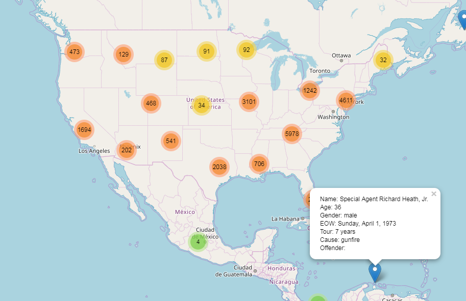
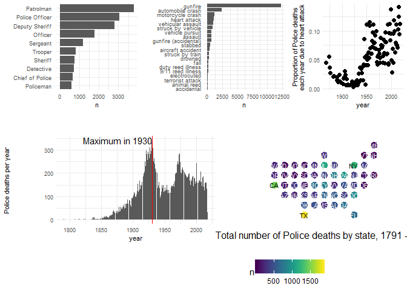

<!-- README.md is generated from README.Rmd. Please edit that file -->
odmp
====

The goal of odmp is to make readily available the data collected by [Officer Down Memorial Page](https://www.odmp.org/), for exploration, visualisation, and analysis.

The Officer Down Memorial Page, Inc., (ODMP) is a non-profit organization dedicated to honoring America's law enforcement that have died in the course of duty. The data are the property of the Officer Down Memorial Page, Inc. We have made the data into this R package for non-commercial educational purposes, such as for use with teaching, research, criticism, commentary, and news reporting.

Installation
------------

You can install the development version of odmp from GitHub with:

``` r
if (!require(devtools)) install.packages("devtools")
devtools::install_github("benmarwick/odmp")
```

A quick look at the data
------------------------

We can load the data like this:

``` r
library(odmp)
data("odmp_1791_2018")
```

And we can inspect the data frame like this:

``` r
library(tidyverse)
#> -- Attaching packages -------------------------------------- tidyverse 1.2.1 --
#> v ggplot2 2.2.1.9000     v purrr   0.2.4     
#> v tibble  1.4.2          v dplyr   0.7.4     
#> v tidyr   0.8.0.9000     v stringr 1.3.0     
#> v readr   1.2.0          v forcats 0.3.0
#> -- Conflicts ----------------------------------------- tidyverse_conflicts() --
#> x dplyr::filter() masks stats::filter()
#> x dplyr::lag()    masks stats::lag()
#> x dplyr::vars()   masks ggplot2::vars()

# what is the structure of the data?
glimpse(odmp_1791_2018)
#> Observations: 23,257
#> Variables: 18
#> $ Age           <dbl> NA, 53, NA, 40, 45, 74, NA, NA, NA, NA, NA, 20, ...
#> $ Tour          <chr> "", "2 years", "", "4 years, 4 months", "", "10 ...
#> $ Badge         <chr> "", "", "", "4", "", "", "", "", "deputy", "", "...
#> $ Cause         <chr> "gunfire", "gunfire", "gunfire", "gunfire", "gun...
#> $ Weapon        <chr> "gun; unknown type", "gun; unknown type", "handg...
#> $ Offender      <chr> "executed in 1791", "acquitted", "executed in 17...
#> $ lat           <dbl> 42.65328, 42.24966, 41.10732, 38.82961, 34.85163...
#> $ long          <dbl> -73.76250, -73.75654, -73.79597, -77.05096, -82....
#> $ name_and_rank <chr> "Constable Darius Quimby", "Sheriff Cornelius Ho...
#> $ eow           <chr> "Monday, January 3, 1791", "Saturday, October 22...
#> $ posix_date    <date> 1791-01-03, 1791-10-22, 1792-05-17, 1794-01-11,...
#> $ year          <dbl> 1791, 1791, 1792, 1794, 1797, 1804, 1806, 1807, ...
#> $ month         <dbl> 1, 10, 5, 1, 11, 10, 12, 3, 1, 3, 8, 8, 1, 1, 1,...
#> $ day           <int> 3, 22, 17, 11, 12, 16, 25, 7, 18, 15, 3, 3, 1, 2...
#> $ gender        <chr> "male", "male", "male", "male", "male", "male", ...
#> $ rank          <chr> "Constable ", "Sheriff ", "Deputy Sheriff ", "Ma...
#> $ name          <chr> "Darius Quimby", "Cornelius Hogeboom", "Isaac Sm...
#> $ State         <chr> "new york", "new york", "new york", "district of...
```

Here is a map of the data. This code will generate an interactive, zoomable map. Here we show just a screenshot of this map.

``` r
library(mapview)
library(sf)

# make a spatial features object for mapping
keywords_df_clean_sf <-
  odmp_age_gender_names_locations %>%
  filter(!is.na(lat)) %>%
  filter(!is.na(long)) %>%
  st_as_sf(coords = c("long", "lat"))

library(leaflet)

m <- leaflet(keywords_df_clean_sf) %>%
  addTiles() %>%  # Add default OpenStreetMap map tiles
  addMarkers(clusterOptions = markerClusterOptions(),
             popup = paste("Name:", keywords_df_clean_sf$name_and_rank, "<br>",
                           "Age:", keywords_df_clean_sf$Age, "<br>",
                           "Gender:", keywords_df_clean_sf$gender, "<br>",
                           "EOW:", keywords_df_clean_sf$eow, "<br>",
                           "Tour:", keywords_df_clean_sf$Tour, "<br>",
                           "Cause:", keywords_df_clean_sf$Cause, "<br>",
                           "Offender:", keywords_df_clean_sf$Offender))
m  # Print the map
```



We can make a simple infographic-style visualisaton:

``` r
library(tidyverse)
theme_set(theme_minimal(base_size = 8))
odmp <- odmp_1791_2018

# how many per year?
n_per_year <-
  ggplot(odmp,
         aes(year)) +
  geom_bar() +
  geom_text(data = odmp %>% count(year, sort = TRUE) %>% slice(1),
            aes(year,
                n + 10,
                label = paste0("Maximum in ", year),
                hjust = 0)) +
  geom_vline(data = odmp %>% count(year, sort = TRUE) %>% slice(1),
                       aes(xintercept = year),
             colour = "red") +
  ylab("Police deaths per year")

# what ranks?
n_ranks <-
  odmp %>%
  group_by(rank) %>%
  tally(sort = TRUE) %>%
  filter(!is.na(rank)) %>%
  slice(1:10) %>%
  ggplot(aes(reorder(rank, n),
             n)) +
  geom_col()  +
  coord_flip() +
  xlab("")

# what cause?
n_cause <-
  odmp %>%
  group_by(Cause) %>%
  tally(sort = TRUE) %>%
  filter(!is.na(Cause)) %>%
  slice(1:20) %>%
  ggplot(aes(reorder(Cause, n),
             n)) +
  geom_col()  +
  coord_flip() +
  xlab("")

# where are the most and least?
library(statebins)
library(viridis)
#> Loading required package: viridisLite
n_where <-
  odmp %>%
  group_by(State) %>%
  tally() %>%
  mutate(State = tools::toTitleCase(State)) %>%
  filter(!is.na(State), State != "NA") %>%
  ggplot(aes(state=State,
             fill=n)) +
  geom_statebins(radius = unit(0.5, "npc")) +
  coord_equal() +
  scale_fill_viridis() +
  xlab(paste0("Total number of Police deaths by state, ",
              min(odmp$year, na.rm = TRUE),
              " - ",
              max(odmp$year, na.rm = TRUE))) +
  theme_statebins()

# proportion of deaths that are heart attacks over time
prop_heart_attack <-
  odmp %>%
  mutate(Cause = if_else(Cause == 'heart attack',
                         Cause,
                         'other')) %>%
  group_by(year,
           Cause) %>%
  tally() %>%
  mutate(prop = prop.table(n)) %>%
  filter(Cause == 'heart attack') %>%
  ggplot(aes(year,
             prop,
             group = 1)) +
  geom_point(size = 2) +
  ylab("Proportion of Police deaths\neach year due to heart attack")

# devtools::install_github("thomasp85/patchwork")
library(patchwork)
p_full <-
  ( n_ranks | n_cause | prop_heart_attack) /
  ( n_per_year | n_where )

p_full
```



Contributing
============

Please note that this project is released with a [Contributor Code of Conduct](CODE_OF_CONDUCT.md). By participating in this project you agree to abide by its terms.
